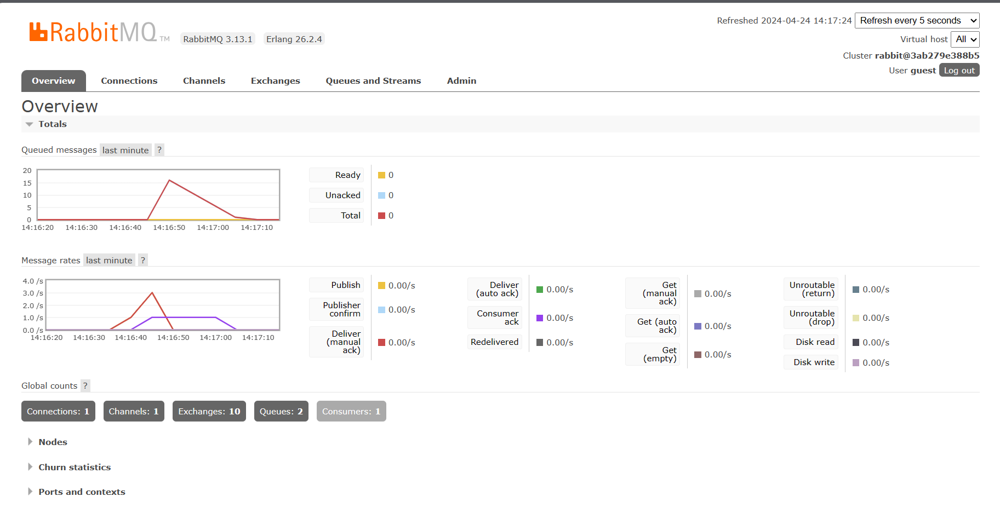

# what is amqp? 

AMQP (Advanced Message Queuing Protocol) adalah protokol lapisan aplikasi standar terbuka untuk middleware berorientasi pesan, yang memungkinkan komunikasi antara aplikasi atau komponen yang berbeda. AMQP dirancang untuk komunikasi asinkronus yang membuatnya cocok untuk penggunaan seperti antrian pesan, routing, dan menghubungkan sistem.

# what it means? guest:guest@localhost:5672 , what is the first quest, and what is  the second guest, and what is localhost:5672 is for?  

"guest:guest@localhost:5672" merujuk pada parameter koneksi default untuk mengakses broker AMQP.
- "guest" adalah nama pengguna default.
- "guest" (diulang) adalah kata sandi default.
- "localhost:5672" menentukan nama host dan nomor port.
    - "localhost" berarti broker AMQP berjalan di mesin lokal.
    - "5672" adalah nomor port default untuk komunikasi AMQP.

Jadi, ketika melihat "guest:guest@localhost:5672", itu menunjukkan nama pengguna default, kata sandi, dan detail koneksi default untuk mengakses broker AMQP yang berjalan di mesin lokal.

# Slow Subscriber Simulation

Dalam percobaan saya, empat cargo run telah dilakukan pada publisher, tetapi kali ini tidak terjadi antrean seperti sebelumnya ketika tiga cargo run sebelumnya menghasilkan 15 antrean. Hal ini disebabkan oleh subscriber yang melakukan multithreading dalam menangani peristiwa komunikasi yang dikirim oleh publisher yang memungkinkan proses berjalan secara paralel.

Ada beberapa peningkatan yang dapat dilakukan pada kode, salah satunya adalah mengimplementasikan paralelisasi pada publisher untuk mengirim sejumlah permintaan secara bersamaan, sehingga mendapatkan simulasi traffic tinggi yang lebih akurat.